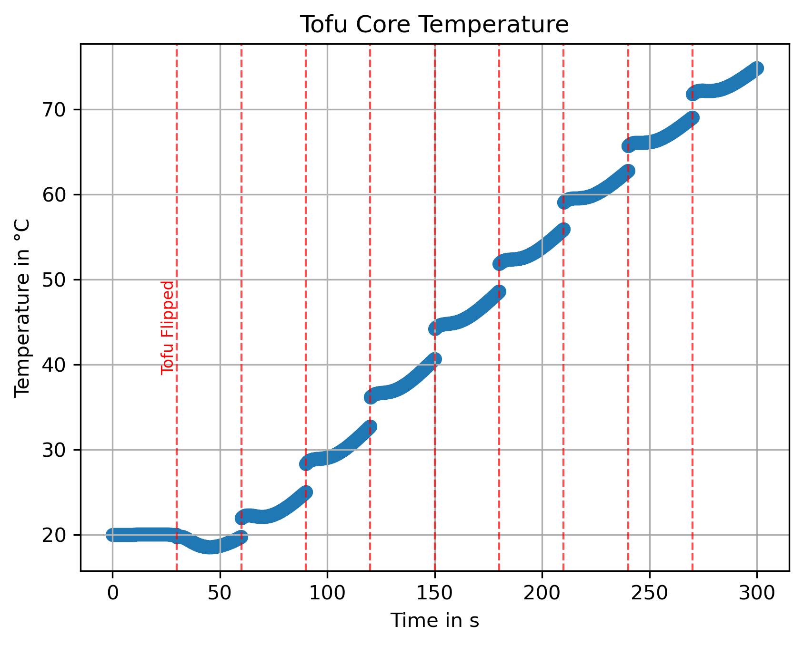

# Heat Diffusion Simulation
Heat diffusion simulation is a pet project programmed in Python to simulate the cooking process of a piece of tofu in a pan by using DOLFINx to run Finite-Element solving methods on basis of the heat diffusion equation. The goal is to study how many times I have to turn a tofu in a cast iron pan, that the center cooks fastest, while not burning the outside. This model however is incomplete as the calculation does not take latent heat for the evaporating water into account, leading to somewhat unrealistic heating behavior as soon as the tofu reaches ~100°C. A more precise description of the tofu using either an effective latent heat term or a moisture field might be added later.

An example core temperature graph would be:

Showing that the tofu heats to roughly 80°C core temperature within 5 minutes under almost constant flipping.

# Usage
The project includes a Variational_Problem class which can be modified by passing different boundary and starting conditions and different weak forms. It should be capable to solve multiple time-dependent linear PDEs, not only the heat equation, although proper support for this is still to be implemented, as well as for non-linear PDEs. The Program further features the option to insert special operations on the variational problem (like flipping the tofu) at any time step. Further a clean way to define different constants on the different sub-domains of the mesh is included. This offers a clean and fast way to answer the tofu question or similar problems you might encounter.

#Features
- The script mesh_creation.py creates a valid geometric mesh and assigns physical regions to it, then usable in the simulation
- Work is done in the jupyter notebook where we can define the functional, material constants and boundary conditions of the problem
- Insert additional operations at choseable discrete time steps (change constants, fields, etc.)
- Definable start and finish time as well as changeable time steps
- Creates a .xdmf file that logs the heat-field over time and saves it for later analysis
- Right now the simulation is only capable of 3d or 2d geometries. The option of interfacing different dimensional geometries might be added later

# Installation
There is no installation procedure planned right now. However, if you want to try. The script requires:
- Python 3.11
- ufl
- gmsh
- gmshio
- DOLFINx
- NumPy
- mpi4py
- json
- pathlib

An working virtual environment will maybe implemented in the future

# Example
You can find an example on how to use this script in the notebook already where the simulation is run for the piece of tofu and the core temperature is plotted.

# Limitations and Future
The simulation seems to have some numerical artifacts. Since a very large volume with wildly different heat conductivities and capacities is modeled, the model seems to be somewhat unstable at the boundary between pan and tofu, however fluctuations seem only a few degrees and get smaller the more the tofu heats up. This can be remidied by increasing pricision both in time and in space. However, both increases in precision (smaller elements or time steps) also greatly increase numerical cost, with the spacial resolution being especially bad. This could be remedied by either introducing a boundary region, in which material constants change more gradually. Further, as mentioned above this simulation falls short of giving a physically accurate simulation of the tofu by lack of latent heat. There are 2 options to change this: introduce a moisture field and track the exact moisture content through coupled PDEs, or introduce an additional term to the heat capacity to effectively model latent heat. Both approaches have different advantages and drawbacks, which i will outline shortly.
## Moisture Field
Introducing a Moinsture field is the most accurate solution, however the internal architecture of the script does not allow coupled PDEs at this moment. Therefore this approach is unrealistic at this time but will be revisited in a later project.
## Apparent Latent Heat
We can introduce a term to the heat capacity of the tofu that includes the latent heat and is only active for temperatures around the boiling point (~95-105°C). This would make sure, that the tofu would have to absorb the latent heat through an increased heat capacity whenever crossing the boiling point. However this system has 2 shortcomings: Firstly by flipping the tofu, regions that might have crossed the boiling point will cross it again, either releasing the latent heat into the environment when cooling back down or absorbing the latent heat twice when crossing the threshold again. To prevent this, we could include a mask, that only allows the latent heat term when a cell crosses the temperature for the first time. This would prevent the boiling of twice problem. Additionally this approach would also ignore the change in heat capacity and conductivity for the dried out tofu. Going forward this will be the most likely solution to this particular problem, as it is numerically cheap and the inaccuracy relatively small compared to the missing latent heat term. However this was not implemented yet, because it would also require a rework of how the constants are defined in this simulation (all constants separately instead of combining constants to compounded prefactors).

# Acknowledgement
I want to thank Jørgen S. Dokken for the very helpful tutorial on https://jsdokken.com/dolfinx-tutorial/.
